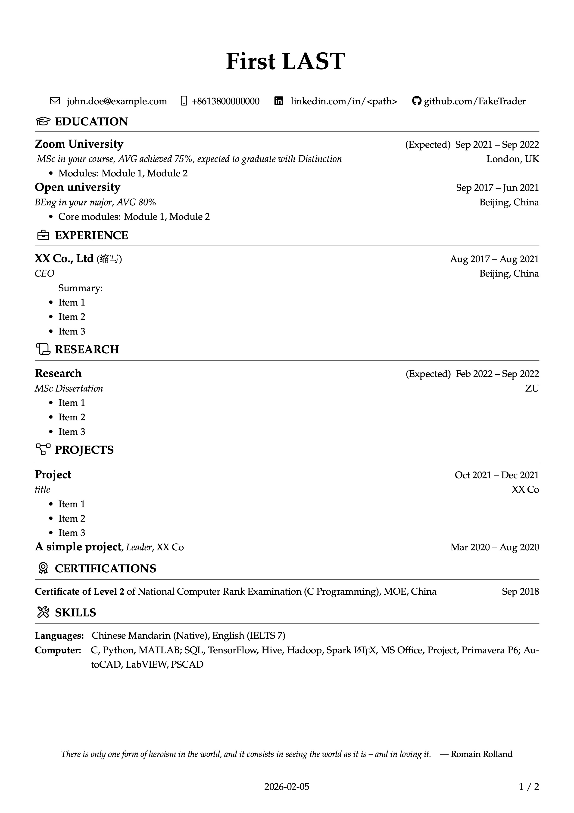
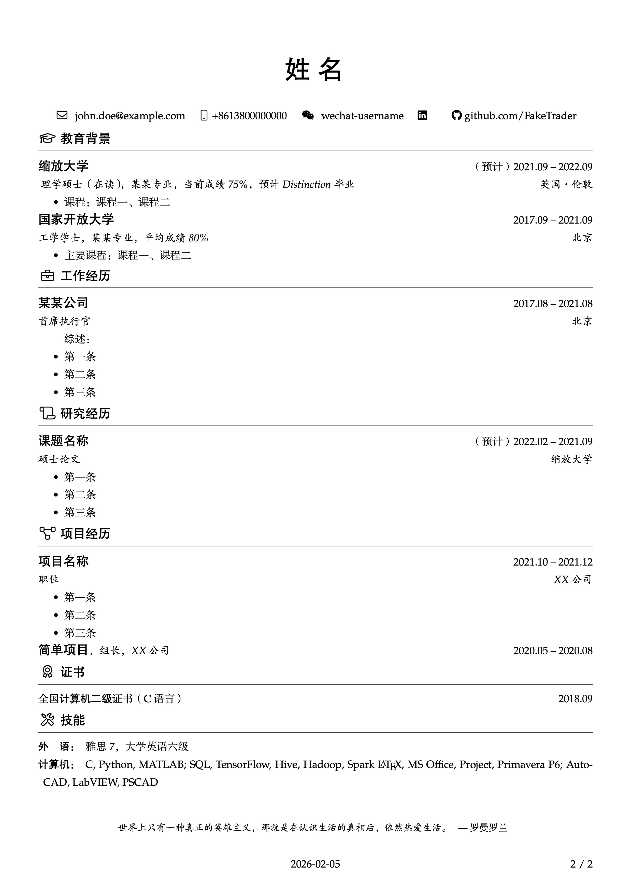

# biCV

Yet another bilingual LaTeX CV




# How to use

Put contents in `content.tex`.

You can add sections like \`Publications' by simply copying the existing ones.

The default languages are Chinese and English. If you are using other languages, please refer to `multiaudience`, and make changes in `biCV.tex`.

Default fonts are free to use: [Font Awesome 5](https://fontawesome.com/v5/search) (I recommend you use Pro fonts if you have licence), [方正书宋](https://www.foundertype.com/index.php/FontInfo/index/id/151), [方正黑体](https://www.foundertype.com/index.php/FontInfo/index/id/131), [方正楷体](https://www.foundertype.com/index.php/FontInfo/index/id/137).

Use latexmk to compile:

```bash
latexmk -pdf
```

You can also choose a version and compile it directly.

Do NOT modify \`.latexmkrc' unless you know what you are doing.

This project is tested on TeXLive (macOS and Overleaf).
